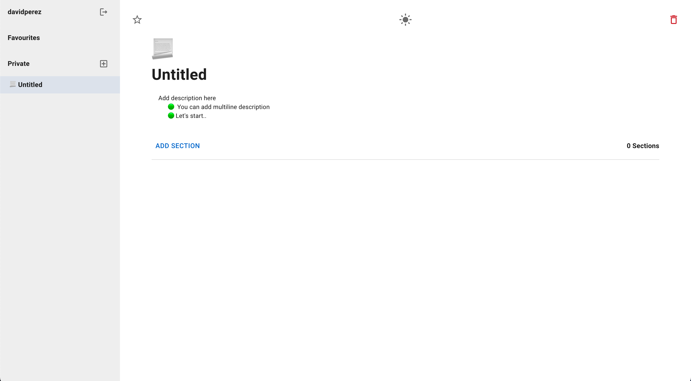
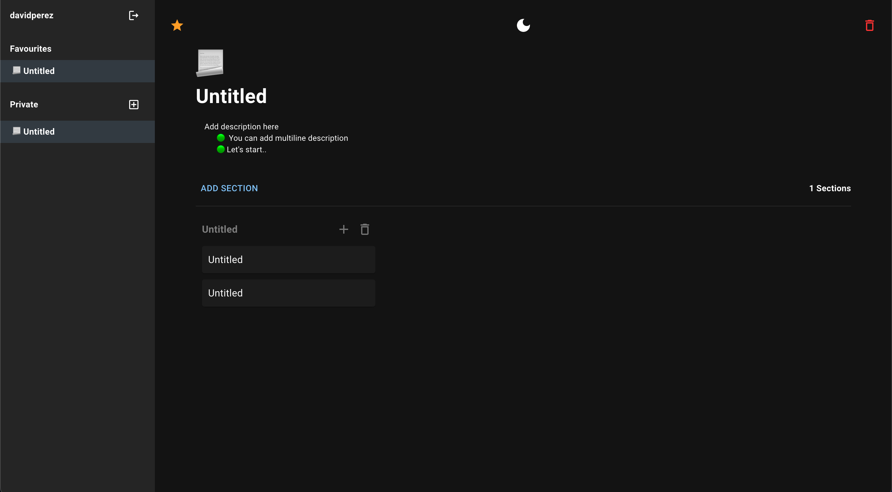
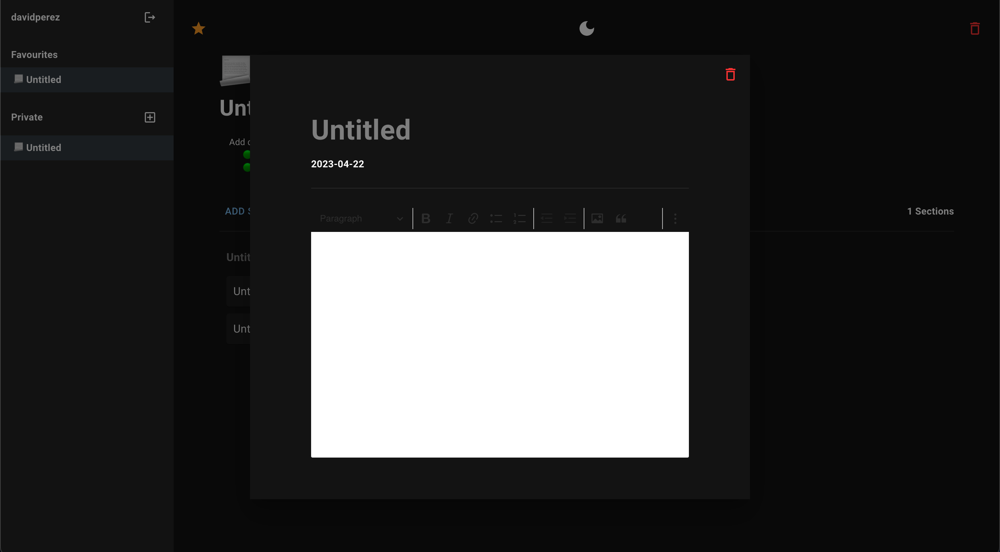

<br/>
<p align="center">
  <h3 align="center">MERN Kanban App</h3>

  <p align="center">
    A fully functional KanBan using React, Redux, MongoDb and Express
    <br/>
    <a href="https://kan-ban-react.netlify.app/">View Demo</a>
  </p>
</p>

   

## Table Of Contents

* [About the Project](#about-the-project)
* [Built With](#built-with)
* [Getting Started](#getting-started)
  * [Installation](#installation)
* [Usage](#usage)
* [Authors](#authors)

## About The Project

This is a comprehensive Full-Stack MERN (MongoDB, Express, React, Node.js) application that incorporates the Kanban methodology for efficient task management. The app was designed with a user-friendly interface using popular technologies such as React, Redux, and Material UI on the Client-Side, and MongoDB and Express on the Backend-Side. 

The app provides a seamless experience for users to visualize, organize and prioritize tasks in real-time, making it an ideal solution for individuals and teams looking to streamline their workflow.

## Built With

The application uses the following technologies: 

* [MongoDB](https://www.mongodb.com/es)
* [Express](https://expressjs.com/es/)
* [React](https://es.react.dev/)
* [Node](https://nodejs.org/en)

## Getting Started

To use this application, simply clone the repository, install the dependencies, and start the development server. Here are the steps:

### Installation


1. Clone the repo

```sh
git clone https://github.com/davidperjac/kan-ban-app.git

For the client directory

2. Install NPM packages

```sh
npm install
```

3. Start the development server

```
npm run dev
```

4. Open your web browser and go to `http://localhost:3000`

```
For the server directory

5. Install NPM packages

```sh
npm install
```

6. Start the development server

```
npm start
```

7. Open your web browser and go to `http://localhost:3001`

## Usage

This application contains the following features: 

- KanBan Board with description, emoji, section and drag and drop functionality
- Pick favourites boards 

- Dark Mode

- Markdown for each card


## Authors

* **David Perez** - *FullStack Developer* - [David Perez](https://github.com/davidperjac) - *App*
